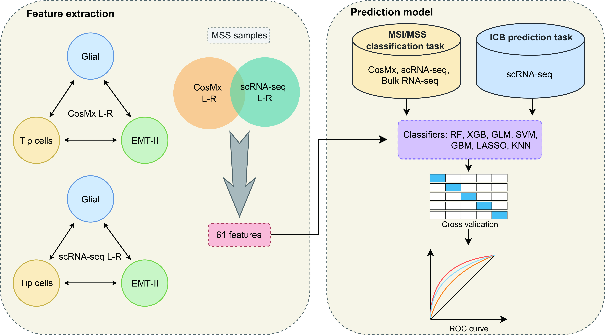

# A spatially defined glial-tip cell niche around tumor boundary promotes mesenchymal tumor states and immune exclusion in microsatellite-stability colorectal cancer


## Introduction


Spatial transcriptomics (ST) offers valuable insights into the tumor microenvironment by integrating molecular features with spatial context, but its clinical diagnostic application is limited due to its high cost. 

To address this, we develop multi-scale convolutional deep learning framework, HiST, which utilizes ST to learn the relationship between spatially resolved gene expression profiles (GEPs) and histological morphology. HiST accurately predicts tumor regions (e.g., breast cancer, area under curve: 0.96), which are highly concordant with pathologist annotations. Then HiST reconstructs spatially resolved GEPs with an average Pearson correlation coefficient of 0.74 across five cancer types, which is >3 folds greater than that of the best previously reported tool. HiST's application module performs well in predicting cancer patient prognosis for five cancer types from the Cancer Genome Atlas (e.g., a concordance index 0.78 in breast cancer) and immunotherapy outcomes. Moreover, spatial GEPs aid to unveil regulatory networks and key regulators to immunotherapy. 

In summary, HiST’s robust performance in tumor identification and reconstruction of spatial GEPs and its applications in prognosis prediction and immunotherapy response offer great potential for advancing tumor profiling and improving personalized cancer treatment.

---


## License

This project is licensed under the MIT License. See the [LICENSE](LICENSE) file for details.

---

## Citation
(Unpublished now)
```
@article{HiST,
    title={HiST: Histological Image Reconstruct Tumor Spatial Transcriptomics via MultiScale Fusion Deep Learning},
    author={Wei Li#, Dong Zhang#, Eryu Peng, Shijun Shen, Yao Liu*, Junke Zheng*, Cizhong Jiang*, Youqiong Ye*},
    journal={XX},
    year={2025},
    doi={xx}
}

```
